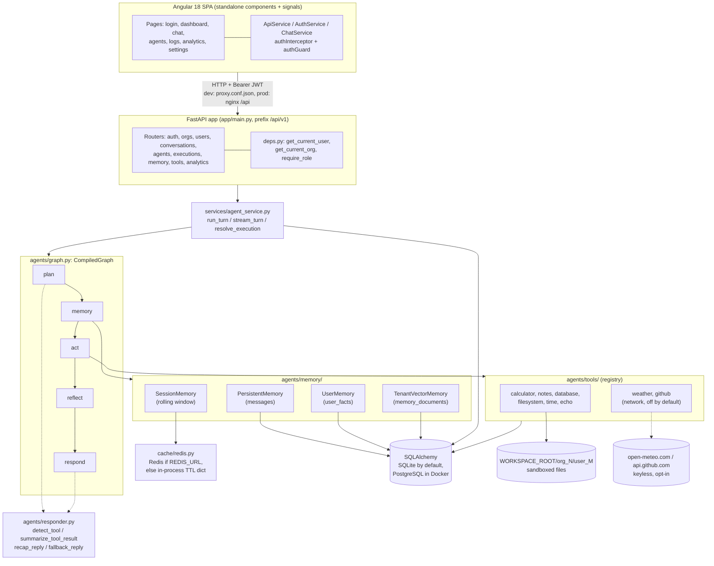

# Enterprise AI Agent Platform

A multi-tenant "ChatGPT Workspace": organizations, users and roles, configurable agents, chat
conversations, a four-layer memory subsystem, a sandboxed tool suite, human-in-the-loop approvals and
usage analytics. The backend is FastAPI, the frontend is Angular 18, and the agent runtime is a
deterministic `plan -> memory -> act -> reflect -> respond` state graph with an offline responder, so
the whole platform boots, chats, calls tools and passes its test suite with **no API key, no LLM
provider account and no external service**. It exists as a learning and portfolio project: the goal
was to build the *infrastructure* around an agent (tenancy, memory layering, tool sandboxing,
approval gating, execution tracing, analytics) honestly enough that swapping the deterministic
responder for a real model would be a contained change rather than a rewrite.

---

## Concepts demonstrated

- **Multi-tenancy done defensively.** Every row carries `org_id`, every query filters on it, the JWT
  pins the tenant, and `get_current_user` re-checks the token's tenant against the user row. A
  dedicated test module sweeps every id-taking endpoint with another tenant's id.
- **Role-based access control** via a dependency factory (`require_role("owner", "admin")`) with a
  clean 401 (who are you) versus 403 (I know you, you may not) split.
- **JWT access and refresh tokens** with `sub`, `org`, `type`, `iat`, `exp` and `jti` claims,
  bcrypt password hashing, and per-tenant unique emails so one person can belong to two orgs.
- **An agent runtime as an explicit state graph**, hand-written in the shape of LangGraph's
  `StateGraph` (nodes, edges, entry point, `compile`, `invoke`, `stream`) so the pipeline is
  inspectable, deterministic and dependency-free.
- **Layered memory:** session (cache), persistent (database), user facts (durable, cross-conversation)
  and vector (bag-of-words cosine similarity over a `memory_documents` table).
- **Tool calling with a real safety story:** AST-evaluated arithmetic instead of `eval`, a per-tenant
  filesystem jail resolved with `Path.resolve`, named parameterised database queries instead of raw
  SQL, and network tools disabled by default rather than faking data.
- **Human-in-the-loop approval:** a paused run persists the exact pending tool call and replays it
  verbatim on approval, so the thing that executes is the thing that was shown.
- **Multi-agent delegation** with the org boundary re-validated at both write time and run time.
- **Streaming** the same turn over Server-Sent Events, built on the graph's `stream()` primitive so
  the streamed path and the plain path run identical code.
- **Graceful degradation:** Redis optional (in-process fallback), PostgreSQL optional (SQLite
  default), internet optional (network tools off).
- **Testing as design pressure:** 87 backend tests, all offline and deterministic.

---

## Architecture



Request flow for one chat turn:

1. The SPA posts to `POST /api/v1/conversations/{id}/messages` with a bearer token.
2. `deps.get_current_user` decodes the JWT, loads the user, and verifies the token's `org` claim
   against `user.org_id`.
3. The route checks the conversation belongs to this org **and** this user, then calls
   `agent_service.run_turn`.
4. `run_turn` calls `graph.run_agent`, which walks `plan -> memory -> act -> reflect -> respond`,
   appending a `{node, detail}` record at every step.
5. `agent_service._persist_outcome` writes the user message, the assistant message, the vector index
   entries and one `Execution` row holding the whole trace, then commits once.
6. The Logs and Analytics pages read those `Execution` rows back.

---

## Tech stack

| Component | Technology | Why this choice |
|---|---|---|
| HTTP API | `fastapi` | Type-driven routing, dependency injection that makes tenancy guards composable, and a free OpenAPI schema at `/docs` |
| ASGI server | `uvicorn[standard]` | The reference ASGI server; the `standard` extras give the HTTP tooling needed for Server-Sent Events streaming |
| ORM / schema | `sqlalchemy` (2.x `Mapped` / `mapped_column`) | One model layer that runs on SQLite locally and PostgreSQL in Docker without changing a line of application code |
| PostgreSQL driver | `psycopg2-binary` | Only needed on the Docker path; SQLite needs no driver at all, which keeps local setup to one `pip install` |
| Validation / config | `pydantic`, `pydantic-settings` | Request and response schemas double as the API contract; `BaseSettings` reads env vars with typed defaults so the app boots with zero configuration |
| Email validation | `email-validator` | Required by pydantic's `EmailStr`, used on register, login and user creation |
| Password hashing | `bcrypt` (used directly) | Slow and salted by design; called directly because `passlib` is unmaintained |
| Tokens | `python-jose[cryptography]` | JWT encode and decode with the claim set the tenancy model needs (`org`, `type`, `jti`) |
| Session cache | `redis` | Short-term memory belongs in a cache, not a table; the import is optional and the code falls back to an in-process TTL dict when `REDIS_URL` is empty or unreachable |
| Tests | `pytest` | Fixture composition (`client`, `register_org`, `two_orgs`) is what makes the multi-tenant isolation sweep readable |
| Test HTTP client | `httpx` | Transport behind `fastapi.testclient.TestClient`; exercises the real ASGI app including SSE responses |
| SPA framework | `@angular/core` 18 with standalone components | No NgModules, lazy `loadComponent` routes, and signals for state, which suits a dashboard-shaped app |
| Routing / guards | `@angular/router` | `CanActivateFn` guard and `RouterLinkActive` navigation in the shell |
| HTTP + auth | `@angular/common` (`HttpClient`) | A functional `HttpInterceptorFn` attaches the bearer token and redirects to `/login` on 401 in one place |
| Forms | `@angular/forms` | `ngModel` two-way binding is enough for the login, agent-builder and settings forms |
| Reactive plumbing | `rxjs` | `Observable`, `forkJoin`, `tap`, `catchError`; also wraps the `fetch` based SSE reader as an observable |
| Angular runtime | `zone.js`, `tslib`, `@angular/animations` | Change detection, TypeScript helpers and the animations peer package required by Angular 18 |
| Bootstrapping | `@angular/compiler`, `@angular/platform-browser` | Standalone app bootstrap from `src/main.ts` |
| Language / build | `typescript`, `@angular/cli`, `@angular-devkit/build-angular` | Strict typing keeps `src/app/models.ts` honest against the backend schemas; the CLI provides `ng serve` with the API proxy and `ng build` |

---

## Folder structure

```
enterprise-ai-agent-platform/
├── backend/
│   ├── app/
│   │   ├── main.py                  FastAPI app: lifespan (create tables + seed), CORS, router wiring
│   │   ├── deps.py                  get_current_user / get_current_org / require_role dependencies
│   │   ├── agents/
│   │   │   ├── graph.py             StateGraph executor + the five pipeline nodes
│   │   │   ├── responder.py         Deterministic intent detection and reply composition (no LLM)
│   │   │   ├── memory/              The four memory layers
│   │   │   │   ├── session.py       Rolling short-term window, cache-backed
│   │   │   │   ├── persistent.py    Durable conversation history in the messages table
│   │   │   │   ├── user.py          Cross-conversation user facts, captured from natural language
│   │   │   │   └── vector.py        Bag-of-words cosine recall over memory_documents
│   │   │   └── tools/               The tool suite
│   │   │       ├── base.py          Tool dataclass, ToolContext, ToolError
│   │   │       ├── registry.py      Name to Tool map, invoke_tool, offline_tool_names
│   │   │       ├── calculator.py    AST-whitelisted arithmetic (no eval)
│   │   │       ├── notes.py         Tenant-scoped note CRUD
│   │   │       ├── database.py      Read-only named queries over the caller's own data
│   │   │       ├── filesystem.py    Per-tenant sandboxed file I/O
│   │   │       ├── network.py       weather + github, keyless and off by default
│   │   │       └── utility.py       echo + time
│   │   ├── api/routes/              One module per resource, all mounted under /api/v1
│   │   ├── core/
│   │   │   ├── config.py            Typed settings with offline-first defaults
│   │   │   └── security.py          bcrypt hashing and JWT create/decode
│   │   ├── db/session.py            Engine, SessionLocal, declarative Base, get_db dependency
│   │   ├── cache/redis.py           SessionCache with a Redis or in-process TTL backend
│   │   ├── models/                  SQLAlchemy ORM models (one file per table)
│   │   ├── schemas/                 Pydantic request/response models (the API contract)
│   │   └── services/
│   │       ├── agent_service.py     run_turn / stream_turn / resolve_execution, persistence + tracing
│   │       └── seed.py              Idempotent demo org, owner and agent on first startup
│   ├── tests/                       Nine pytest modules, all offline
│   ├── requirements.txt             Backend dependencies
│   ├── Dockerfile                   python:3.12-slim, runs uvicorn
│   └── .env.example                 Config template (every value has a working default)
├── frontend/
│   ├── src/app/
│   │   ├── app.component.ts         Shell: sidebar, topbar, chrome hidden on /login
│   │   ├── app.routes.ts            Lazy routes behind authGuard
│   │   ├── app.config.ts            provideRouter + provideHttpClient(withInterceptors)
│   │   ├── models.ts                TypeScript mirrors of the backend Pydantic schemas
│   │   ├── core/                    authGuard (route protection) and authInterceptor (token + 401)
│   │   ├── services/                ApiService, AuthService, ChatService (including the SSE reader)
│   │   └── pages/                   login, dashboard, chat, agents, logs, analytics, settings
│   ├── src/styles.scss              Global design tokens and shared component classes
│   ├── src/environments/            apiBase configuration (relative /api/v1)
│   ├── proxy.conf.json              Dev proxy: /api to http://localhost:8000
│   ├── nginx.conf                   Prod: SPA fallback + /api/ proxy to the backend container
│   ├── Dockerfile                   node:20-alpine build stage, nginx:alpine serve stage
│   └── angular.json                 Build and serve targets
├── .github/workflows/ci.yml         CI: pytest on Python 3.12, then ng build on Node 20
├── docker-compose.yml               postgres:16 + redis:7 + backend + frontend
├── MEMORY.md                        The original working spec for this repo
├── LICENSE                          MIT
└── README.md                        This file
```

---

## Codebase walkthrough

This is the section to read if you want to understand the repository without opening it.

### `backend/app/core` and `backend/app/db`: foundations

`core/config.py` defines a single pydantic-settings `Settings` class and exports a cached
`settings = get_settings()`. Every field has a default that works with nothing installed:
`DATABASE_URL` is `sqlite:///./platform.db`, `REDIS_URL` is empty, `ALLOW_NETWORK_TOOLS` is `False`,
`SEED_DEMO_DATA` is `True`. `cors_origins_list` splits the comma-separated `CORS_ORIGINS` string into
the list FastAPI's middleware wants. Because `get_settings` is `lru_cache`d, tests set environment
variables *before* importing the app (see `tests/conftest.py`).

`core/security.py` holds the two security primitives. `hash_password` and `verify_password` wrap
`bcrypt`, explicitly truncating to 72 bytes because bcrypt ignores anything past that and would
otherwise raise on long inputs. `_create_token` builds the claim set (`sub` is the user id, `org` is
the tenant id, `type` is `access` or `refresh`, plus `iat`, `exp`, `jti`) and `create_access_token`
and `create_refresh_token` differ only in lifetime and type. `decode_token` validates signature and
expiry and raises `jose.JWTError`, which is re-exported so callers do not need to import jose.

`db/session.py` creates the SQLAlchemy `engine` (adding `check_same_thread=False` only for SQLite),
the `SessionLocal` factory, the declarative `Base` that every model inherits, and the `get_db`
FastAPI dependency that yields a session and always closes it.

`cache/redis.py` contains `_InProcessCache` (a thread-safe TTL dict with `get`, `set` and `delete`)
and `SessionCache`, which stores a rolling window of turns as a JSON string under the key
`session:org:{org_id}:conv:{conversation_id}`. The org id is in the key deliberately: a shared Redis
can outlive a database and a recycled conversation id must never surface another tenant's context.
`_build_backend()` tries a real Redis client only when `REDIS_URL` is set, pings it, and falls back
to the in-process cache on any failure. `get_session_cache()` memoises the result, and
`reset_session_cache()` exists so tests cannot bleed into each other.

### `backend/app/models`: the schema

Ten modules: nine tables plus the role enum. Each table model imports `Base` from `db/session.py`
and is re-exported from `models/__init__.py` so `Base.metadata.create_all` sees the whole schema.

- `org.py` (`Org`) is the tenant boundary: `name`, unique `slug`, `plan`, and cascading
  relationships to users and agents.
- `user.py` (`User`) has `org_id`, `email`, `hashed_password`, `role`, `is_active`, and a
  `UniqueConstraint("org_id", "email")`, so the same address can exist in two orgs.
- `role.py` (`Role`) is a `str` enum (`OWNER`, `ADMIN`, `MEMBER`) with a `values()` helper, stored as
  a plain string column rather than a separate table.
- `agent.py` (`Agent`) stores `system_prompt`, plus two JSON-encoded text columns exposed as typed
  properties: `enabled_tools` behind `agent.tools` and `teammate_ids` behind `agent.teammates`.
  `_decode_list` tolerates corrupt values by returning `[]`. `requires_approval` drives the
  human-in-the-loop gate.
- `conversation.py` (`Conversation`) has `org_id`, `user_id`, an optional `agent_id`, `title`, and a
  `messages` relationship ordered by id with delete-orphan cascade.
- `message.py` (`Message`) is one turn: `role` (`user`, `assistant` or `tool`), `content`, and
  JSON `tool_calls`.
- `execution.py` (`Execution`) is one agent run: `status` (module constants `COMPLETED`, `FAILED`,
  `AWAITING_APPROVAL`, `REJECTED`), JSON `steps` (the trace), `tokens_used`, `user_id` (needed to
  resume an approval in the right user context), and `pending_action` holding the paused tool call.
- `user_fact.py` (`UserFact`), `note.py` (`Note`) and `memory_document.py` (`MemoryDocument`) all
  carry both `org_id` and `user_id` and are always queried on both.

### `backend/app/agents/graph.py`: the runtime

The file opens with a miniature `StateGraph` (`add_node`, `add_edge`, `set_entry_point`, `compile`)
that produces a `CompiledGraph` dataclass. `CompiledGraph.stream(state)` walks from the entry node
along the edge map, yielding `(node_name, state)` after each node and bounded by
`len(self.nodes) + 1` iterations so an accidental cycle cannot hang. `invoke(state)` simply drains
`stream`, which is the reason the SSE path and the plain path can never diverge.

The five node functions each take and return the state dict and append one `{node, detail}` record:

- `_plan_node` decides the turn's shape. If `forced_intent` is set (an approved, resumed run) it
  replays that exact tool call. Otherwise it asks `responder.wants_recap`, then
  `responder.detect_tool(message, enabled_tools)`. If nothing local matches it iterates
  `state["teammates"]` and takes the first `Teammate` whose tools do match, which is the
  multi-agent delegation path.
- `_memory_node` touches all four layers: `UserMemory.maybe_capture` and `maybe_forget` on the raw
  message, `TenantVectorMemory.index` for the message itself, `all_facts()` for durable facts, a
  `search(message, k=3)` for related items (filtering out the message's own echo), and
  `SessionMemory.history()` for the short-term window. If the session window is cold, it falls back
  to `PersistentMemory.recent(limit=10)` and appends the current turn, so the recap summariser sees
  the same shape either way.
- `_act_node` runs the tool through `registry.invoke_tool`, unless `requires_approval` is set and the
  run is not `pre_approved`, in which case it sets `awaiting_approval`, stores
  `{"tool", "params", "message"}` in `pending_action` and stops short of executing anything. A
  `ToolError` is caught and recorded as `tool_error` rather than raised.
- `_reflect_node` writes a one-line self-check (waiting on a human, tool failed, tool succeeded,
  recap, or direct answer) chosen from the state.
- `_respond_node` composes the reply: an approval prompt, an error explanation,
  `responder.summarize_tool_result`, `responder.recap_reply`, or `responder.fallback_reply` with
  captured or forgotten fact prefixes. It also sets `tokens_used` to a deterministic word-count
  estimate of input plus output.

`_build_graph()` wires `plan -> memory -> act -> reflect -> respond -> END` once at import into the
module-level `_GRAPH`. `_initial_state` filters the enabled tool list against the registry,
constructs the four memory objects and a `ToolContext`, and appends the user turn to session memory
unless `record_user_turn=False` (a resumed run). `_status_for` maps end state to
`awaiting_approval`, `failed` or `completed`, and `_finalize` appends the assistant turn to session
memory and returns an `AgentResult`. The public API is `stream_agent` (yields `AgentEvent`s of type
`step`, then one `result`) and `run_agent` (drains the stream and returns the `AgentResult`).

### `backend/app/agents/responder.py`: the offline brain

Where an LLM would sit, there is a set of compiled regexes and pure functions. `detect_tool` checks
patterns in a deliberate order (echo, then filesystem verbs, then database phrasing, then notes,
then weather, then github, then calculator, then time) so that, for example, "list files" never
falls through to the notes tool. `_extract_expression` only treats text as arithmetic when it is
made of math characters and contains an operator, so a bare number is not a calculation.
`wants_recap` matches "recap", "summarise this conversation", "what did we talk about".

On the output side, `summarize_tool_result` turns each tool's raw dict into a sentence, delegating to
`_summarize_database` and `_summarize_filesystem` for the multi-action tools. `recap_reply` renders
the session window minus the current turn. `fallback_reply` handles greetings, a capability listing
for "help", and otherwise leads with recalled context before `_reflective_ack` echoes the user's
message back. Every function here is deterministic, which is precisely why the chat tests can assert
on exact strings.

### `backend/app/agents/memory`: four layers

- `session.py` (`SessionMemory`) is a thin `(org_id, conversation_id)` facade over
  `cache.redis.get_session_cache()`, with `add`, `history` and `clear`.
- `persistent.py` (`PersistentMemory`) writes and reads `Message` rows for one conversation:
  `add(role, content, tool_calls)`, `history(limit=50)` oldest-first, and `recent(limit=10)` which
  queries newest-first then reverses. It is the durable fallback when the session cache is cold.
- `user.py` (`UserMemory`) owns `UserFact` rows. `maybe_capture` matches `remember (that) ...` and
  stores the remainder; `maybe_forget` matches `forget (that) ...` and deletes at most one
  substring-matching fact, deliberately conservative so a vague phrase cannot wipe everything.
  `all_facts`, `rows`, `add` and `delete(fact_id)` back the memory API. Every query filters on
  `org_id` **and** `user_id`.
- `vector.py` splits into a pure engine and a persistent wrapper. `_vectorize` tokenises to a
  `Counter` after dropping a stopword list, `_cosine` scores two counters, `VectorMemory` is the
  in-memory store used for unit testing the scorer, and `TenantVectorMemory` is what the runtime
  uses: `index(text, kind, conversation_id)` skips blanks and exact duplicates, and
  `search(text, k, min_score=0.05)` scores every `MemoryDocument` row for this `(org, user)` pair in
  Python, returning sorted `VectorHit`s. Sorting is by `(-score, id)` so results are stable enough
  for tests to assert on.

### `backend/app/agents/tools`: the tool suite

`base.py` defines `ToolContext` (`db`, `org_id`, `user_id`), `ToolError`, and the `Tool` dataclass
(`name`, `description`, `parameters`, `run`, `examples`, `requires_network`) with `invoke` and
`to_dict`. `registry.py` holds the ordered `_TOOLS` dict and exposes `all_tools`, `tool_names`,
`offline_tool_names` (used to seed the demo agent), `get_tool` and `invoke_tool`.

- `calculator.py` parses with `ast.parse(expr, mode="eval")` and walks the tree through
  `_eval_node`, permitting only whitelisted `_BIN_OPS`, `_UNARY_OPS`, `_NAMES` (`pi`, `e`, `tau`) and
  `_FUNCS` (`sqrt`, `abs`, `round`, `floor`, `ceil`, `log`, `sin`, `cos`, `tan`). Anything else
  raises `ToolError`. `safe_eval` is exported and tested directly.
- `filesystem.py` gives each `(org, user)` pair a directory at
  `WORKSPACE_ROOT/org_{id}/user_{id}` via `tenant_root`. `resolve_in_sandbox` rejects absolute and
  `~` paths, then resolves the candidate and requires the resolved sandbox root to be one of its
  parents, which is what actually defeats `../` and symlink tricks. Actions are `list`, `write`
  (capped at 64 KiB), `read` and `delete`.
- `database.py` exposes four named, parameterised queries (`stats`, `conversations`, `agents`,
  `search_messages`) instead of letting an agent near raw SQL. All filter on `ctx.org_id`, and the
  per-user views also filter on `ctx.user_id`; row counts are capped at 20.
- `notes.py` is `create`, `list`, `get` and `delete` over the `Note` table, always scoped by
  `org_id` and `user_id`, with `_lookup` raising `ToolError` for a missing or foreign id.
- `network.py` holds the only two tools that leave the process. Both call `_require_network_enabled`
  first and raise a clear `ToolError` when `ALLOW_NETWORK_TOOLS` is false, rather than inventing
  data. The HTTP fetch (`_get_json`, stdlib `urllib`) is separate from the pure parsers
  (`parse_forecast`, `parse_repo`), and the parsers are what the tests exercise.
- `utility.py` is `echo` and `time`.

### `backend/app/services`

`agent_service.py` is the seam between HTTP and the runtime. `load_teammates` resolves an agent's
`teammates` ids back to `Teammate` objects while re-applying `Agent.org_id == agent.org_id`, so a
stale id cannot pull in another tenant's agent. `_persist_outcome` is the single write path: it adds
the user message and the assistant message through `PersistentMemory`, indexes the reply into
`TenantVectorMemory`, builds the `Execution` row (status, JSON steps, token estimate, pending
action), auto-titles a conversation still called "New conversation" from its first user message,
bumps `updated_at`, and commits once. Both messages are written *after* the graph finishes, so a
client that disconnects mid-stream never leaves half a turn behind.

`run_turn` calls `run_agent` and then `_persist_outcome`, returning a `TurnResult` dataclass.
`stream_turn` drives `stream_agent`, yields one JSON-ready `{"event": "step", ...}` dict per node,
persists once at the end, and yields a final `{"event": "result", ...}` carrying
`conversation_id`, `message_id`, `execution_id`, `status`, `tools_used` and `reply`.
`resolve_execution(db, execution, approve=...)` implements the approval lifecycle: it refuses
anything not in `awaiting_approval`; on rejection it writes a refusal message and marks the row
`rejected`; on approval it re-runs the graph with `pre_approved=True`,
`forced_intent=(tool, params)` and `record_user_turn=False`, appends an `approval` step plus the
replayed trace, adds the tokens, and marks it `completed`.

`seed.py` runs from the app lifespan. It is idempotent (it returns early if the demo slug already
exists) and creates the "Acme Inc" org, the `demo@acme.com` owner, and a "Workspace Assistant" agent
enabled with `offline_tool_names()` only, so the demo works with no internet.

### `backend/app/api/routes`: the HTTP surface

- `auth.py`: `register` creates an org (with `_unique_slug` disambiguating collisions) plus its first
  owner and returns tokens. `login` is careful about per-tenant emails, checking the password against
  every candidate account rather than the first row, so a user with two workspaces is not locked out
  of the second. `refresh` validates the token type before minting a new pair. `me` returns user plus
  org.
- `orgs.py` and `users.py`: reading your own org (403 for someone else's id), listing org users, and
  creating users behind `require_role(OWNER, ADMIN)` with role validation.
- `agents.py`: CRUD plus `POST /{id}/run`. `_validate_tools` rejects names not in the registry,
  `_validate_teammates` rejects ids that are not same-org agents or that are the agent itself, and
  `_get_owned_agent` is the 404-on-foreign-id helper. `/{id}/executions` reuses
  `executions.scope_executions` so the visibility rule is defined once.
- `conversations.py`: list, create, list messages, `POST /{id}/messages` (returns both messages,
  `tools_used`, `steps` and `status`), and `POST /{id}/messages/stream` which wraps `stream_turn` in
  a `StreamingResponse` of `text/event-stream`. Ownership is checked *before* the response starts,
  because once streaming begins the status code has already been sent.
- `executions.py`: the complete run history the Logs view wants, including turns with no agent
  attached. `can_view_execution` and `scope_executions` encode the two-level rule: the org filter
  always applies, and a plain member only sees runs they triggered while owners and admins see the
  whole org. `_to_detail` decodes the JSON trace, and `approve` and `reject` delegate to
  `resolve_execution`, mapping its `ValueError` to a 409.
- `memory.py`: `/facts` (list, add, delete, with an add also indexed into vector memory so it is
  immediately recallable), `/recall` (top-k vector search), `/session/{conversation_id}` (the live
  cache window), and `/overview` (fact, document and message counts).
- `tools.py`: `GET /tools` returns each tool's `to_dict()` including `requires_network`, and
  `POST /tools/{name}/invoke` builds a `ToolContext` from the caller and turns `ToolError` into 400.
- `analytics.py`: `/usage` counts users, agents, conversations, messages, executions and summed
  tokens for the org; `/executions` aggregates run outcomes and derives per-tool usage by regexing
  `Executed '<tool>'` out of the stored `act` steps (the same regex covers delegated
  `[via Teammate] Executed '...'` lines).

`main.py` ties it together: a lifespan that runs `Base.metadata.create_all` and `seed_demo_data`,
CORS middleware from `settings.cors_origins_list`, a `/health` probe, and nine routers mounted under
`/api/v1`.

### `backend/app/schemas`

Pydantic models per area (`auth`, `common`, `conversation`, `agent`, `memory`, `analytics`), using
`ConfigDict(from_attributes=True)` for the ORM-backed responses. Worth noting: `AgentOut` exposes the
decoded `tools` and `teammates` lists rather than the raw JSON columns, `ExecutionDetail` extends
`ExecutionOut` with `steps` and `pending_action`, and `RegisterRequest` enforces an 8 character
minimum password.

### `frontend/src/app`

`app.config.ts` provides the router and `HttpClient` with `authInterceptor`. `app.routes.ts` lazily
`loadComponent`s every page and wraps all but `/login` in `authGuard`. `app.component.ts` is the
shell: a responsive sidebar with the nav list, a topbar whose title is `computed` from the current
URL, org, user and role display from `AuthService.me()`, and chrome hidden on `/login` or when
unauthenticated.

`core/auth.guard.ts` redirects to `/login` when no token is present. `core/auth.interceptor.ts`
clones each request with the bearer header and, on a 401 while a token existed, logs out and
navigates to `/login`.

`services/api.service.ts` is a typed `get` / `post` / `patch` / `delete` wrapper over
`environment.apiBase` (`/api/v1`, relative so the same build works behind the dev proxy and behind
nginx). `services/auth.service.ts` keeps the token in a signal mirrored to `localStorage`
(`eap_access` and `eap_refresh`), exposes `isAuthenticated` as a `computed`, and holds `me` as a
signal. `services/chat.service.ts` wraps the conversation endpoints and implements `streamMessage`
by hand: `HttpClient` cannot surface a body incrementally, so it uses `fetch` with a
`ReadableStream` reader, attaches the auth header itself (the interceptor never sees this request),
buffers partial SSE frames across chunks, and aborts the request on unsubscribe.

`models.ts` mirrors the backend schemas in TypeScript, including a discriminated `StreamEvent` union
for the two SSE shapes.

The pages: `login` (sign in, register, and a one-click demo button using `demo@acme.com`),
`dashboard` (stat tiles from `/analytics/usage`), `chat` (conversation list, thread, composer,
typing indicator, auto-scroll via `AfterViewChecked`, optimistic user bubble), `agents` (tool
checkboxes built from `/tools`, create and delete), `logs` (fans `/agents` out into
`/agents/{id}/executions` and merges the rows), `analytics` (outcome counts and a tool-usage bar
breakdown from `/analytics/executions`), and `settings` (org details plus team listing and member
invitation).

### `backend/tests`

`conftest.py` sets the offline environment variables before the app import, gives every test its own
temp SQLite file with `get_db` overridden, resets the session cache singleton between tests, and
points `WORKSPACE_ROOT` at a per-test `tmp_path`. The `register_org`, `auth_client` and `two_orgs`
fixtures make two-tenant tests cheap to write, which is what allows `test_isolation.py` to be a
sweep over every id-taking endpoint rather than a handful of one-off cases.

---

## Installation

Requires Python 3.11 or newer and, for the UI, Node 20. The backend needs nothing else: no database
server, no Redis, no API key.

### Backend

```bash
git clone https://github.com/ranjan-del/enterprise-ai-agent-platform.git
cd enterprise-ai-agent-platform/backend

python3 -m venv .venv
source .venv/bin/activate          # Windows: .venv\Scripts\activate
pip install -r requirements.txt

uvicorn app.main:app --reload --port 8000
```

The app creates its SQLite tables and seeds the demo tenant on startup. Open
<http://localhost:8000/docs> for the interactive OpenAPI UI, or <http://localhost:8000/health> for a
liveness check. To override any default, copy `.env.example` to `.env` first.

### Frontend

In a second terminal:

```bash
cd enterprise-ai-agent-platform/frontend
npm install
npm start                          # ng serve, proxies /api to localhost:8000
```

Then open <http://localhost:4200> and use the demo login: `demo@acme.com` / `demopass123`.

### Everything at once with Docker

```bash
cd enterprise-ai-agent-platform
docker compose up --build
```

That brings up `postgres:16`, `redis:7`, the FastAPI backend on port 8000 and the nginx-served
Angular build on <http://localhost:4200>.

---

## Usage

All of the output below was captured from a real run of `uvicorn app.main:app --port 8123` against a
fresh database, with no API key and no network tools enabled.

### 1. Log in as the seeded demo owner

```bash
curl -s http://127.0.0.1:8123/health
# {"status":"ok"}

TOKEN=$(curl -s -X POST http://127.0.0.1:8123/api/v1/auth/login \
  -H 'Content-Type: application/json' \
  -d '{"email":"demo@acme.com","password":"demopass123"}' \
  | python -c "import sys,json;print(json.load(sys.stdin)['access_token'])")

curl -s http://127.0.0.1:8123/api/v1/auth/me -H "Authorization: Bearer $TOKEN"
```

```json
{
    "user": {
        "id": 1,
        "email": "demo@acme.com",
        "role": "owner",
        "is_active": true,
        "org_id": 1
    },
    "org": {
        "id": 1,
        "name": "Acme Inc",
        "slug": "acme-inc",
        "plan": "pro"
    }
}
```

Without a token, protected routes answer `401`:

```bash
curl -s -o /dev/null -w "%{http_code}\n" http://127.0.0.1:8123/api/v1/agents
# 401
```

### 2. The seeded agent

```bash
curl -s http://127.0.0.1:8123/api/v1/agents -H "Authorization: Bearer $TOKEN"
```

```json
[
    {
        "id": 1,
        "name": "Workspace Assistant",
        "description": "A general-purpose assistant with every offline tool enabled.",
        "system_prompt": "You are a helpful enterprise workspace assistant.",
        "tools": ["calculator", "notes", "database", "filesystem", "time", "echo"],
        "teammates": [],
        "requires_approval": false,
        "org_id": 1
    }
]
```

### 3. Chat, with the full step trace

Messages are posted into a conversation, so create one first. On a fresh database this is conversation 1.

```bash
curl -s -X POST http://127.0.0.1:8123/api/v1/conversations \
  -H "Authorization: Bearer $TOKEN" -H 'Content-Type: application/json' \
  -d '{}'

curl -s -X POST http://127.0.0.1:8123/api/v1/conversations/1/messages \
  -H "Authorization: Bearer $TOKEN" -H 'Content-Type: application/json' \
  -d '{"content":"calculate 12 * (3 + 4)"}'
```

```json
{
    "conversation_id": 1,
    "user_message": {
        "id": 1,
        "role": "user",
        "content": "calculate 12 * (3 + 4)",
        "created_at": "2026-08-02T18:18:21.836790"
    },
    "assistant_message": {
        "id": 2,
        "role": "assistant",
        "content": "The result of `12 * (3 + 4)` is **84**.",
        "created_at": "2026-08-02T18:18:21.838049"
    },
    "tools_used": ["calculator"],
    "steps": [
        {"node": "plan",    "detail": "Selected tool 'calculator' with params {'expression': '12 * (3 + 4)'}."},
        {"node": "memory",  "detail": "Recalled 0 fact(s), 0 related item(s), 1 recent turn(s)."},
        {"node": "act",     "detail": "Executed 'calculator' -> {'expression': '12 * (3 + 4)', 'result': 84}"},
        {"node": "reflect", "detail": "Tool result obtained; will summarise it clearly."},
        {"node": "respond", "detail": "Final reply composed."}
    ],
    "status": "completed"
}
```

### 4. Teaching it a fact (user memory)

Sending `remember that my flagship project is Apollo` produced:

```
reply:  Got it, I'll remember that my flagship project is Apollo.
        Here's what I recall that seems related:
        • my flagship project is Apollo
        You said: “remember that my flagship project is Apollo”. I've recorded this in the
        conversation. Ask me to calculate something, check the time, or manage notes and
        I'll act on it.

steps:  plan     No tool required; will answer from memory/knowledge.
        memory   Remembered new fact: 'my flagship project is Apollo'. Recalled 1 fact(s),
                 1 related item(s), 3 recent turn(s).
        act      No tool executed.
        reflect  Composing a direct answer from context.
        respond  Final reply composed.
```

### 5. Streaming the same pipeline over SSE

```bash
curl -sN -X POST http://127.0.0.1:8123/api/v1/conversations/1/messages/stream \
  -H "Authorization: Bearer $TOKEN" -H 'Content-Type: application/json' \
  -d '{"content":"note: renew the TLS certificate"}'
```

```
event: step
data: {"event": "step", "node": "plan", "detail": "Selected tool 'notes' with params {'action': 'create', 'title': 'renew the TLS certificate', 'body': 'renew the TLS certificate'}."}

event: step
data: {"event": "step", "node": "memory", "detail": "Recalled 1 fact(s), 0 related item(s), 5 recent turn(s)."}

event: step
data: {"event": "step", "node": "act", "detail": "Executed 'notes' -> {'action': 'create', 'note': {'id': 1, 'title': 'renew the TLS certificate', 'body': 'renew the TLS certificate', 'created_at': '2026-08-02T18:18:31.477265'}}"}

event: step
data: {"event": "step", "node": "reflect", "detail": "Tool result obtained; will summarise it clearly."}

event: step
data: {"event": "step", "node": "respond", "detail": "Final reply composed."}

event: result
data: {"event": "result", "conversation_id": 1, "message_id": 6, "execution_id": 3, "status": "completed", "tools_used": ["notes"], "reply": "Saved note #1: “renew the TLS certificate”."}
```

### 6. Vector recall

```bash
curl -s "http://127.0.0.1:8123/api/v1/memory/recall?q=apollo%20project&k=3" \
  -H "Authorization: Bearer $TOKEN"
```

```json
{
    "query": "apollo project",
    "hits": [
        {"id": 3, "kind": "fact",    "text": "my flagship project is Apollo",               "score": 0.8165},
        {"id": 4, "kind": "message", "text": "remember that my flagship project is Apollo", "score": 0.7071},
        {"id": 5, "kind": "message", "text": "Got it, I'll remember that my flagship project is Apollo. ...", "score": 0.5828}
    ]
}
```

`GET /api/v1/memory/overview` at that point returned
`{"facts": 1, "documents": 7, "messages": 6}`.

### 7. Human-in-the-loop approval

Create an agent that must ask first, then give it something to do:

```bash
curl -s -X POST http://127.0.0.1:8123/api/v1/agents \
  -H "Authorization: Bearer $TOKEN" -H 'Content-Type: application/json' \
  -d '{"name":"Gated Ops","description":"Needs sign-off","tools":["filesystem","calculator"],"requires_approval":true}'

curl -s -X POST http://127.0.0.1:8123/api/v1/agents/2/run \
  -H "Authorization: Bearer $TOKEN" -H 'Content-Type: application/json' \
  -d '{"message":"write file runbook.md: restart the api pod"}'
```

The run pauses instead of writing anything (the response also carries the full `steps` array, trimmed
here for readability):

```json
{
    "conversation_id": 2,
    "reply": "This needs your approval first: I want to run **filesystem** with `{'action': 'write', 'path': 'runbook.md', 'content': 'restart the api pod'}`. Approve or reject it from the Logs page.",
    "tools_used": [],
    "execution_id": 4,
    "status": "awaiting_approval"
}
```

Approving replays that exact call and appends the replay to the same trace:

```bash
curl -s -X POST http://127.0.0.1:8123/api/v1/executions/4/approve -H "Authorization: Bearer $TOKEN"
```

The response also includes `agent_id`, `conversation_id`, `started_at` and `finished_at`, trimmed here:

```json
{
    "id": 4,
    "status": "completed",
    "tokens_used": 47,
    "steps": [
        {"node": "plan",     "detail": "Selected tool 'filesystem' with params {'action': 'write', 'path': 'runbook.md', 'content': 'restart the api pod'}."},
        {"node": "memory",   "detail": "Recalled 1 fact(s), 0 related item(s), 1 recent turn(s)."},
        {"node": "act",      "detail": "Paused: 'filesystem' needs human approval before it runs."},
        {"node": "reflect",  "detail": "Waiting on a human decision; will ask for approval."},
        {"node": "respond",  "detail": "Final reply composed."},
        {"node": "approval", "detail": "Approved by the user; replaying the tool call."},
        {"node": "plan",     "detail": "Replaying approved tool 'filesystem' with params {'action': 'write', 'path': 'runbook.md', 'content': 'restart the api pod'}."},
        {"node": "memory",   "detail": "Recalled 1 fact(s), 1 related item(s), 2 recent turn(s)."},
        {"node": "act",      "detail": "Executed 'filesystem' -> {'action': 'write', 'path': 'runbook.md', 'bytes': 19}"},
        {"node": "reflect",  "detail": "Tool result obtained; will summarise it clearly."},
        {"node": "respond",  "detail": "Final reply composed."}
    ],
    "pending_action": null
}
```

### 8. The tool catalogue

```bash
curl -s http://127.0.0.1:8123/api/v1/tools -H "Authorization: Bearer $TOKEN"
```

Summarised to name, network flag and the start of each description:

```
calculator   network=False  Evaluate an arithmetic expression safely (supports + - * / *...
notes        network=False  Create, list, read, and delete personal notes (persisted, te...
database     network=False  Run read-only, tenant-scoped queries over your workspace dat...
filesystem   network=False  Read, write, list and delete text files in your private, san...
time         network=False  Return the current UTC date and time.
echo         network=False  Return the given text unchanged (useful for testing tool cal...
weather      network=True   Current conditions for a place, via the keyless Open-Meteo A...
github       network=True   Public repository facts (stars, forks, issues, language) fro...
```

Invoking one directly:

```bash
curl -s -X POST http://127.0.0.1:8123/api/v1/tools/database/invoke \
  -H "Authorization: Bearer $TOKEN" -H 'Content-Type: application/json' \
  -d '{"params":{"action":"stats"}}'
```

```json
{
    "tool": "database",
    "result": {
        "action": "stats",
        "stats": {"users": 1, "agents": 2, "conversations": 2, "messages": 9, "executions": 4}
    }
}
```

### 9. Analytics after that session

```bash
curl -s http://127.0.0.1:8123/api/v1/analytics/usage      -H "Authorization: Bearer $TOKEN"
curl -s http://127.0.0.1:8123/api/v1/analytics/executions -H "Authorization: Bearer $TOKEN"
```

```json
{"org_id": 1, "users": 1, "agents": 2, "conversations": 2, "messages": 9, "executions": 4, "tokens_used": 136}
```

```json
{
    "total_executions": 4,
    "completed": 4,
    "failed": 0,
    "awaiting_approval": 0,
    "rejected": 0,
    "tokens_used": 136,
    "tool_usage": {"calculator": 1, "notes": 1, "filesystem": 1}
}
```

---

## API reference

Every path below is prefixed with `/api/v1` except `/health`. "Auth" means a valid bearer access
token is required; "owner/admin" means the role guard applies on top of that. This table matches the
36 operations in the generated OpenAPI schema.

| Endpoint | Method | Auth | Purpose |
|---|---|---|---|
| `/health` | GET | No | Liveness probe, returns `{"status":"ok"}` |
| `/auth/register` | POST | No | Create an organization plus its first owner user, returns a token pair |
| `/auth/login` | POST | No | Authenticate (optionally within an `org_slug`), returns a token pair |
| `/auth/refresh` | POST | No (refresh token in body) | Exchange a refresh token for a fresh access and refresh pair |
| `/auth/me` | GET | Yes | Current user plus their organization |
| `/orgs` | GET | Yes | List organizations visible to the caller (their own only) |
| `/orgs/{org_id}` | GET | Yes | Read one organization; 403 for anyone else's id |
| `/users` | GET | Yes | List users in the caller's organization |
| `/users` | POST | Owner/admin | Create a user in the caller's organization |
| `/users/{user_id}` | GET | Yes | Read one user in the caller's organization |
| `/agents` | GET | Yes | List the organization's agents |
| `/agents` | POST | Owner/admin | Create an agent (tools and teammates are validated) |
| `/agents/{agent_id}` | GET | Yes | Read one agent |
| `/agents/{agent_id}` | PATCH | Owner/admin | Update name, description, prompt, tools, teammates, approval flag |
| `/agents/{agent_id}` | DELETE | Owner/admin | Delete an agent |
| `/agents/{agent_id}/run` | POST | Yes | Run the agent on a message, creating a conversation if none is given |
| `/agents/{agent_id}/executions` | GET | Yes | Runs of this agent, filtered by the caller's visibility |
| `/conversations` | GET | Yes | The caller's conversations, most recently active first |
| `/conversations` | POST | Yes | Create a conversation, optionally bound to an agent |
| `/conversations/{conversation_id}/messages` | GET | Yes | Full message history for a conversation you own |
| `/conversations/{conversation_id}/messages` | POST | Yes | Send a message, run the agent, return both turns plus the trace |
| `/conversations/{conversation_id}/messages/stream` | POST | Yes | Same turn as Server-Sent Events (one `step` per node, then `result`) |
| `/executions` | GET | Yes | Run history (`limit`, `status` filters); members see their own, owners and admins see the org |
| `/executions/{execution_id}` | GET | Yes | One run with its full step trace and any pending action |
| `/executions/{execution_id}/approve` | POST | Yes | Approve a paused run; the stored tool call is replayed verbatim |
| `/executions/{execution_id}/reject` | POST | Yes | Reject a paused run; nothing executes and the thread records it |
| `/memory/facts` | GET | Yes | List the caller's remembered facts |
| `/memory/facts` | POST | Yes | Add a fact (also indexed into vector memory) |
| `/memory/facts/{fact_id}` | DELETE | Yes | Delete one of the caller's facts |
| `/memory/recall` | GET | Yes | Top-k similarity search over the caller's indexed memory (`q`, `k`) |
| `/memory/session/{conversation_id}` | GET | Yes | The short-term window currently held in the session cache |
| `/memory/overview` | GET | Yes | Counts of facts, indexed documents and messages |
| `/tools` | GET | Yes | Tool catalogue with parameters, examples and `requires_network` |
| `/tools/{name}/invoke` | POST | Yes | Invoke a tool directly with a params object |
| `/analytics/usage` | GET | Yes | Org totals: users, agents, conversations, messages, executions, tokens |
| `/analytics/executions` | GET | Yes | Run outcomes plus per-tool usage counts |

Interactive documentation is generated by FastAPI at `/docs` (Swagger UI) and `/redoc`.

---

## Testing

```bash
cd backend
source .venv/bin/activate
pytest -q
```

Observed result on this machine (Python 3.14.6, macOS):

```
........................................................................ [ 82%]
...............                                                          [100%]
87 passed, 1 warning in 24.89s
```

The single warning is a Starlette deprecation notice about `httpx` in `TestClient`, not a failure in
this code. The 87 tests break down as:

| Module | Tests | Covers |
|---|---:|---|
| `tests/test_tools_extra.py` | 22 | Database tool, filesystem sandbox escapes, and the network tools' pure parsers |
| `tests/test_isolation.py` | 16 | Every id-taking endpoint probed with another tenant's id |
| `tests/test_tools.py` | 10 | Calculator safety and correctness, notes CRUD, echo and time |
| `tests/test_memory.py` | 10 | Session, persistent, user and vector layers, engine and API |
| `tests/test_chat.py` | 8 | Chat orchestration and the deterministic responder |
| `tests/test_auth.py` | 7 | Register, login, refresh, me, health |
| `tests/test_approval.py` | 6 | Pause, approve, reject and the replay guarantee |
| `tests/test_multi_agent.py` | 5 | Delegation to a teammate agent |
| `tests/test_streaming.py` | 3 | SSE frame shape and ordering |

The suite needs no network, no Redis, no PostgreSQL and no API key. `.github/workflows/ci.yml` runs
the same `pytest -q` on Python 3.12 and then `ng build` on Node 20.

---

## Design decisions and trade-offs

**A hand-written state graph instead of LangGraph.** The original spec named LangGraph. The pipeline
here is linear, so the executor fits in about forty lines, and writing it kept the entire runtime
importable, deterministic and free of a heavyweight dependency tree. The shape was kept
LangGraph-compatible on purpose (`add_node`, `add_edge`, `set_entry_point`, `compile`, `invoke`,
`stream`), so adopting the real library later is a substitution rather than a redesign. The cost is
that branching, cycles and checkpointing are not supported.

**A deterministic responder instead of an LLM.** This is the biggest decision in the repo. A
portfolio project that needs someone's API key to demo is a project nobody demos, and a
non-deterministic responder cannot be asserted against in tests. So `responder.py` does regex intent
detection and templated summarisation. The trade-off is blunt and worth stating plainly: this is not
a language model and it does not generalise. What it does prove out is everything *around* the
model, and the LLM-shaped seam is small (`detect_tool` plus the `summarize_*` and `fallback_reply`
functions).

**Bag-of-words cosine instead of embeddings.** `vector.py` scores a stopword-filtered `Counter` per
document with an honest O(n) scan over the tenant's rows. No embedding service, no extra database
extension, and deterministic scores that tests can assert on. It will not find synonyms, and it will
get slow with tens of thousands of documents per user. The interface (`index`, and `search`
returning scored hits) is the same one pgvector or Qdrant would expose.

**Named queries instead of SQL for the database tool.** Handing an agent raw SQL would be an
injection hole and a tenancy hole at the same time. Four named, parameterised actions cover the
useful cases while making a cross-tenant query literally unexpressible.

**A resolved-path jail instead of string checks for the filesystem tool.** Rejecting strings that
contain `..` is theatre. `resolve_in_sandbox` resolves the candidate path (which collapses `..` and
follows symlinks) and requires the resolved sandbox root to be one of its parents.

**Network tools disabled by default.** Rather than mocking weather data (dishonest) or requiring
internet (fragile), `weather` and `github` raise a clear error explaining the flag. Their HTTP calls
and their parsers are separate functions so the parsers can be tested without a network.

**Redis and PostgreSQL both optional.** Session memory falls back to an in-process TTL dict, and
SQLAlchemy handles both SQLite and PostgreSQL. `docker compose up` gives the real thing; `pip
install` plus `uvicorn` gives a working thing.

**Tenancy checked more than once.** The JWT carries the org, `get_current_user` re-checks it against
the user row, every query filters on `org_id`, and delegation re-validates teammate ids at run time
as well as write time. Redundant by design: any single missed check should still not produce a leak.

**Persistence after the graph, not during.** Messages and the execution row are written in one commit
after the final node, so a client that disconnects mid-stream leaves either the whole exchange or
nothing at all.

**Role as a string column, not a table.** The role set is fixed at three values. A `roles` table with
a join would add migrations and queries for no expressiveness gain at this size.

---

## Limitations and future improvements

This is a learning project. It is not production ready, and the following are known gaps rather than
oversights.

**Not production ready**

- No database migrations. Schema changes rely on `Base.metadata.create_all`, which only creates
  missing tables. Alembic would be the first thing to add before any real deployment.
- `JWT_SECRET` defaults to `change-me`, and the demo tenant (`demo@acme.com` / `demopass123`) is
  seeded automatically whenever `SEED_DEMO_DATA` is true, which it is by default.
- No rate limiting, no account lockout, no audit log beyond the execution trace, and no token
  revocation despite the `jti` claim being present for exactly that purpose.
- No structured logging, metrics or tracing.
- The token estimate in `_respond_node` is a word count, not a tokenizer. Analytics figures are
  indicative only.

**Feature gaps between backend and frontend**

- The Logs page builds its rows by fanning out over `/agents/{id}/executions`, so runs from
  conversations with no agent attached (which is what the Chat page creates) do not appear there.
  The `/executions` endpoint already returns the complete list and would be the better source.
- The approval prompt tells the user to approve or reject from the Logs page, but those buttons are
  not built yet. The endpoints work and are covered by tests, but today you drive them with curl or
  from `/docs`.
- `ChatService.streamMessage` fully implements the SSE reader, but the Chat page still uses the
  plain `POST /messages` path, so the live plan, memory, act, reflect and respond trace is not shown
  in the UI yet.
- There is no memory page in the SPA, so facts, recall and the session window are backend-only.
- The Agents page creates agents with a name, description and tools, but does not expose the
  `teammates` or `requires_approval` fields that the API and the runtime support.
- The refresh token is stored in `localStorage` but never exchanged: when the 30 minute access token
  expires the interceptor simply logs the user out. Storing tokens in `localStorage` is itself a
  known XSS trade-off.

**Runtime limitations**

- Intent detection is regex-based, so phrasing outside the recognised patterns falls through to the
  generic acknowledgement.
- The graph is strictly linear. There is no loop, no re-planning after a failed tool call, and no
  parallel tool execution.
- Delegation picks the first teammate whose tools match, with no negotiation, no chaining and no
  teammate-of-teammate traversal.
- Vector recall is lexical, not semantic, and rescans the tenant's documents on every query.
- Approval is all-or-nothing per agent (`requires_approval`), not per tool or per risk level.
- The Gmail and Google Drive tools named in the original spec were not built; the tool suite is
  calculator, notes, database, filesystem, time, echo, weather and github.

**Natural next steps**

1. Alembic migrations and a hardened configuration profile.
2. A pluggable responder interface so a real model provider can be dropped in behind the same
   `detect_tool` and `summarize` seam, with the deterministic responder kept as the test double.
3. Swap `TenantVectorMemory`'s scoring for pgvector while keeping the class interface.
4. Wire the UI to `/executions`, add approve and reject buttons, and switch the Chat page to the
   streaming endpoint.
5. Frontend unit tests; there are currently none.
6. Refresh-token rotation with silent renewal in the interceptor.

---

## License

MIT. See [LICENSE](LICENSE). Copyright (c) 2026 ranjan-del.
