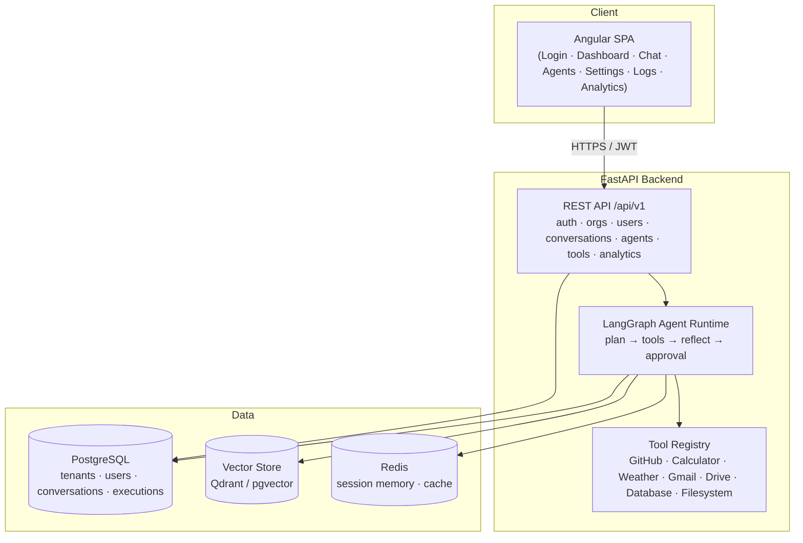

# Enterprise AI Agent Platform

A multi-tenant **"ChatGPT Workspace"** — an enterprise platform where organizations, users, and roles collaborate with configurable AI agents. Agents plan, call tools, reflect, stream responses, request human approval, and coordinate as multi-agent teams, all backed by layered memory (session, persistent, user, and vector).

Built with **FastAPI + LangGraph + PostgreSQL + Redis** on the backend and an **Angular** frontend, orchestrated with Docker.

> Status: early scaffold. Modules are skeletons with `TODO:` markers referencing the build checklist. No feature logic is implemented yet.

---

## Architecture Diagram



---

## Folder Structure

```
enterprise-ai-agent-platform/
├── backend/
│   ├── app/
│   │   ├── main.py                # FastAPI app + /health + router wiring
│   │   ├── core/                  # config.py, security.py (JWT, hashing)
│   │   ├── api/routes/            # auth, orgs, users, conversations, agents, tools, analytics
│   │   ├── models/                # org, user, role, conversation, message, agent, execution
│   │   ├── schemas/               # pydantic request/response contracts
│   │   ├── agents/
│   │   │   ├── graph.py           # LangGraph state graph skeleton
│   │   │   ├── memory/            # session, persistent, user, vector
│   │   │   └── tools/             # github, calculator, weather, gmail, drive, database, filesystem
│   │   ├── db/session.py          # SQLAlchemy engine + session
│   │   └── cache/redis.py         # Redis client factory
│   ├── requirements.txt           # dependency manifest (not installed)
│   ├── Dockerfile
│   └── .env.example
├── frontend/
│   ├── src/app/
│   │   ├── pages/                 # login, dashboard, chat, agents, settings, logs, analytics
│   │   └── services/              # api, auth, chat
│   ├── package.json               # dependency manifest (not installed)
│   ├── angular.json
│   ├── tsconfig.json
│   └── Dockerfile
├── docker-compose.yml             # db · redis · backend · frontend
├── LICENSE
└── README.md
```

---

## Installation Guide

### Prerequisites
- Docker + Docker Compose
- (For local dev without Docker) Python 3.12+, Node 20+

### Quick start (Docker)
```bash
git clone https://github.com/ranjan-del/enterprise-ai-agent-platform.git
cd enterprise-ai-agent-platform
cp backend/.env.example backend/.env   # then edit secrets
docker compose up
```
This brings up four services: **db** (PostgreSQL), **redis**, **backend** (FastAPI, `:8000`), and **frontend** (Angular, `:4200`).

### Local dev (without Docker)
```bash
# Backend
cd backend
python -m venv .venv && source .venv/bin/activate
pip install -r requirements.txt
uvicorn app.main:app --reload

# Frontend
cd frontend
npm install
npm start
```

---

## Features

**Platform**
- JWT authentication, organizations, users, and roles (multi-tenant)
- Dashboard: conversations, agents, execution history, memory, analytics

**Agents**
- Memory, planning, tool calling, reflection, streaming, human approval, multi-agent collaboration

**Tools**
- GitHub, Calculator, Weather, Gmail, Google Drive, Database, File System

**Memory**
- Session (Redis), Persistent (PostgreSQL), User, and Vector (Qdrant / pgvector)

---

## Screenshots

_Coming soon_

---

## Demo GIF

_Coming soon_

---

## API Documentation

Interactive docs are served at `/docs` (Swagger) and `/redoc` once the backend is running.

| Method | Endpoint | Description |
| ------ | -------- | ----------- |
| GET | `/health` | Liveness probe |
| POST | `/api/v1/auth/login` | Exchange credentials for a JWT |
| POST | `/api/v1/auth/refresh` | Rotate access token |
| GET | `/api/v1/auth/me` | Current user + tenant context |
| GET/POST | `/api/v1/orgs` | List / create organizations |
| GET | `/api/v1/orgs/{org_id}` | Fetch an organization |
| GET/POST | `/api/v1/users` | List / create users |
| GET | `/api/v1/users/{user_id}` | Fetch a user |
| GET/POST | `/api/v1/conversations` | List / create conversations |
| GET/POST | `/api/v1/conversations/{id}/messages` | List / send messages (streaming) |
| GET/POST | `/api/v1/agents` | List / create agents |
| POST | `/api/v1/agents/{id}/run` | Execute an agent |
| GET | `/api/v1/agents/{id}/executions` | Execution history |
| GET | `/api/v1/tools` | List available tools |
| POST | `/api/v1/tools/{name}/invoke` | Invoke a tool directly |
| GET | `/api/v1/analytics/usage` | Usage metrics |
| GET | `/api/v1/analytics/executions` | Execution analytics |

---

## Hosting (deploy live)

- **Frontend (Angular):** Firebase Hosting — serves the built SPA and rewrites `/api` calls to the backend host (Firebase cannot run the Python backend itself).
- **Backend (FastAPI + LangGraph):** Cloud Run (WebSockets/streaming OK) or Render/Railway (Docker-native, no card).
- **PostgreSQL:** Neon or Supabase free tier.
- **Redis:** Upstash free tier.
- **Vector store:** Qdrant Cloud or pgvector.

---

## Future Improvements

- Full auth + RBAC enforcement across tenants
- Complete LangGraph runtime (planning, reflection, human-in-the-loop, multi-agent hand-off)
- Real tool integrations with OAuth flows
- Vector memory + RAG retrieval
- Execution tracing and analytics dashboards
- CI/CD, test suites, and observability

---

## License

Released under the [MIT License](./LICENSE). Copyright (c) 2026 ranjan-del.
