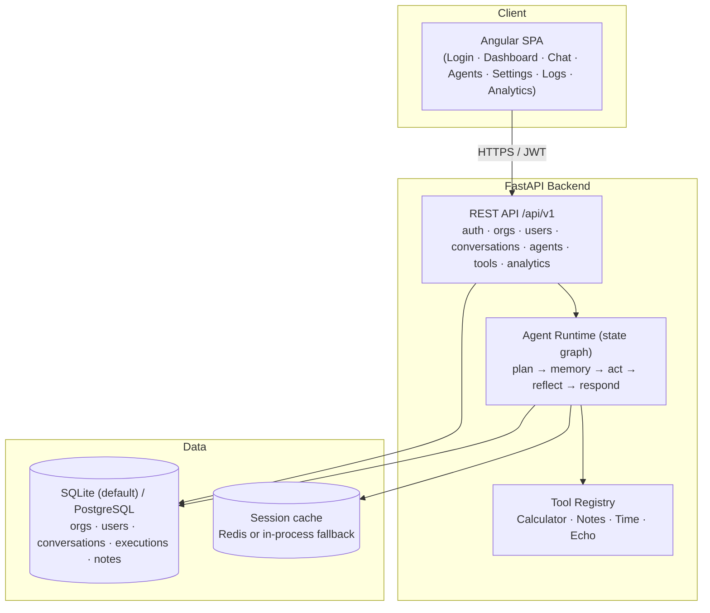

# Enterprise AI Agent Platform

A multi-tenant **"ChatGPT Workspace"** — organizations, users, and roles collaborate with configurable AI agents. Agents plan, call tools, recall layered memory (session, persistent, user, vector), reflect, and answer, all through a deterministic state-graph runtime.

Built with **FastAPI + SQLAlchemy** on the backend and an **Angular** frontend, orchestrated with Docker.

> **Status: working vertical slice.** Real JWT auth with multi-tenancy, SQLite/PostgreSQL persistence, a plan → memory → act → reflect → respond agent runtime, four offline tools, a usable Angular workspace (login, dashboard, chat, agents, settings, logs, analytics), a green pytest suite, and CI. **Everything runs and is tested with zero external API keys and zero paid services** — the agent uses a deterministic offline responder, Redis falls back to an in-process cache, and the database defaults to SQLite.

---

## Architecture Diagram



---

## Folder Structure

```
enterprise-ai-agent-platform/
├── backend/
│   ├── app/
│   │   ├── main.py                # FastAPI app + /health + router wiring + startup seed
│   │   ├── deps.py                # current-user / current-org / role guards
│   │   ├── core/                  # config.py, security.py (JWT + bcrypt)
│   │   ├── api/routes/            # auth, orgs, users, conversations, agents, tools, analytics
│   │   ├── models/                # org, user, role, conversation, message, agent, execution, note, user_fact
│   │   ├── schemas/               # pydantic request/response contracts
│   │   ├── agents/
│   │   │   ├── graph.py           # deterministic StateGraph orchestrator + run_agent
│   │   │   ├── responder.py       # offline intent detection + reply generation
│   │   │   ├── memory/            # session, persistent, user, vector
│   │   │   └── tools/             # base, registry, calculator, notes, utility (time/echo)
│   │   ├── services/              # agent_service (run a turn), seed (demo data)
│   │   ├── db/session.py          # SQLAlchemy engine + session
│   │   └── cache/redis.py         # session cache w/ in-process fallback
│   ├── tests/                     # pytest: auth, tools, chat/agent runtime
│   ├── requirements.txt
│   ├── Dockerfile
│   └── .env.example
├── frontend/
│   ├── src/app/
│   │   ├── core/                  # auth interceptor + route guard
│   │   ├── pages/                 # login, dashboard, chat, agents, settings, logs, analytics
│   │   ├── services/              # api, auth, chat
│   │   └── models.ts              # typed API contracts
│   ├── nginx.conf                 # SPA routing + /api proxy (prod image)
│   ├── proxy.conf.json            # dev proxy to the backend
│   ├── package.json / angular.json / tsconfig.json
│   └── Dockerfile
├── .github/workflows/ci.yml       # backend pytest + frontend ng build
├── docker-compose.yml             # db · redis · backend · frontend
├── LICENSE
└── README.md
```

---

## Installation Guide

### Quick start (Docker)
```bash
git clone https://github.com/ranjan-del/enterprise-ai-agent-platform.git
cd enterprise-ai-agent-platform
docker compose up --build
```
Brings up four services: **db** (PostgreSQL), **redis**, **backend** (FastAPI, `:8000`), and **frontend** (Angular via nginx, `:4200`). Open <http://localhost:4200> and sign in with the seeded demo account:

```
email:    demo@acme.com
password: demopass123
```

### Local dev (no Docker, no external services)
```bash
# Backend — offline by default (SQLite + in-process cache, no API keys)
cd backend
python -m venv .venv && source .venv/bin/activate
pip install -r requirements.txt
uvicorn app.main:app --reload          # http://localhost:8000  (docs at /docs)

# Frontend — proxies /api to the backend during dev
cd frontend
npm install
npm start                              # http://localhost:4200
```

---

## Features

**Platform**
- JWT authentication (bcrypt password hashing, access + refresh tokens)
- Multi-tenancy: registering creates an organization + owner; all data is strictly org-scoped
- Roles: owner / admin / member, enforced on user and agent management
- Angular workspace: login/register, dashboard, chat, agents, settings, logs, analytics

**Agent runtime**
- Deterministic state graph: `plan → memory → act → reflect → respond` (same shape as LangGraph)
- Layered memory: **session** (Redis or in-process), **persistent** (DB messages), **user** (durable facts captured from "remember that …"), and **vector** (dependency-free bag-of-words recall)
- Real assistant output from an **offline deterministic responder** — no LLM key required
- Every run recorded as an `Execution` with a step trace, tools used, and a token estimate

**Tools (all run offline)**
- **Calculator** — safe arithmetic via AST parsing (no `eval`); supports `+ - * / ** %`, `sqrt`, `sin`, `cos`, `log`, `pi`, `e`
- **Notes** — tenant-scoped CRUD persisted in the database
- **Time** — current UTC date/time
- **Echo** — returns input unchanged (handy for testing tool calls)

**Analytics**
- Usage metrics (users, agents, conversations, messages, executions, tokens)
- Execution analytics with a per-tool usage breakdown

---

## Screenshots

_Not captured (headless build environment)._

## Demo GIF

_Not captured (headless build environment)._

---

## API Documentation

Interactive docs are served at `/docs` (Swagger) and `/redoc` when the backend is running.

| Method | Endpoint | Description |
| ------ | -------- | ----------- |
| GET | `/health` | Liveness probe |
| POST | `/api/v1/auth/register` | Create an org + owner and return tokens |
| POST | `/api/v1/auth/login` | Exchange credentials for access + refresh tokens |
| POST | `/api/v1/auth/refresh` | Rotate the access token |
| GET | `/api/v1/auth/me` | Current user + tenant context |
| GET | `/api/v1/orgs` · `/api/v1/orgs/{id}` | List / fetch the caller's organization |
| GET/POST | `/api/v1/users` | List / create users (create: owner/admin) |
| GET | `/api/v1/users/{id}` | Fetch a user in the tenant |
| GET/POST | `/api/v1/conversations` | List / create conversations |
| GET/POST | `/api/v1/conversations/{id}/messages` | List messages / send a message (runs the agent) |
| GET/POST | `/api/v1/agents` | List / create agents (create: owner/admin) |
| GET/PATCH/DELETE | `/api/v1/agents/{id}` | Fetch / update / delete an agent |
| POST | `/api/v1/agents/{id}/run` | Execute an agent |
| GET | `/api/v1/agents/{id}/executions` | Execution history |
| GET | `/api/v1/tools` | List available tools |
| POST | `/api/v1/tools/{name}/invoke` | Invoke a tool directly |
| GET | `/api/v1/analytics/usage` | Usage metrics |
| GET | `/api/v1/analytics/executions` | Execution analytics + tool usage |

---

## Testing & CI

```bash
cd backend && pytest -q          # 22 tests: auth + multi-tenancy, tools, chat/agent runtime
cd frontend && npx ng build      # production build
```

GitHub Actions (`.github/workflows/ci.yml`) runs the pytest suite (on SQLite, no external services) and the Angular build on every push and pull request to `main`.

---

## Future Improvements

- Streaming responses (SSE/WebSocket) and human-in-the-loop approval steps
- Multi-agent hand-off and richer planning/reflection
- Pluggable LLM backend behind the deterministic responder (opt-in via API key)
- Real external tool integrations (GitHub, Gmail, Drive) with OAuth
- Real vector store (Qdrant / pgvector) behind the current `VectorMemory` interface
- Alembic migrations and refresh-token revocation

---

## License

Released under the [MIT License](./LICENSE). Copyright (c) 2026 ranjan-del.
